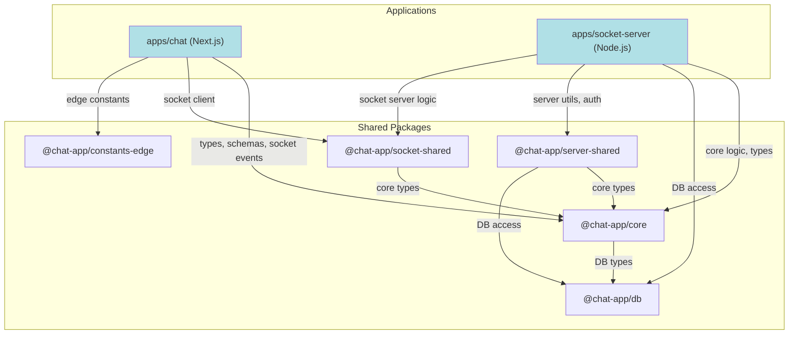

# Архитектура Приложения "Chat App"

Этот документ описывает высокоуровневую архитектуру проекта, ключевые решения и потоки данных.

## 1. Обзор: Архитектура Монорепозитория

Проект построен на основе **монорепозитория** с использованием **pnpm Workspaces** и **Turborepo**. Такой подход позволяет:
-   **Централизованно управлять зависимостями**: Все пакеты используют единые версии библиотек.
-   **Переиспользовать код**: Общая логика вынесена в разделяемые пакеты (`packages`).
-   **Оптимизировать сборку**: `Turborepo` кэширует результаты сборки и тестов, значительно ускоряя CI/CD.

Структура состоит из двух основных частей:
-   `apps/`: Исполняемые приложения (Next.js фронтенд, Socket.IO сервер).
-   `packages/`: Переиспользуемые пакеты с логикой, типами и утилитами.

## 2. Ключевые Архитектурные Принципы

-   **Schema-Driven Development**: Разработка "от схемы".
    -   **`@chat-app/db` (Prisma Schema)**: Единственный источник истины для структуры базы данных.
    -   **`@chat-app/core` (Zod Schemas)**: Источник истины для публичных API-контрактов. Все типы для API-ответов и DTO генерируются из Zod-схем (`z.infer`).
-   **Четкое разделение ответственности**: Каждый пакет имеет одну, четко определенную зону ответственности.
-   **Изоморфность**: Пакет `@chat-app/core` является изоморфным, то есть его код может выполняться как на сервере, так и на клиенте.
-   **Безопасность**: Серверная логика и секреты (`@chat-app/server-shared`) строго отделены от клиентского кода.

## 3. Схема Зависимостей Пакетов

## 4. Описание Пакетов

-   **`@chat-app/db`**:
    -   **Ответственность**: Слой доступа к данным.
    -   **Содержит**: Схему Prisma, сгенерированный Prisma Client, скрипт для сидинга (`seed.ts`).
    -   **Экспортирует**: `PrismaClient` и все сгенерированные типы данных.

-   **`@chat-app/core`**:
    -   **Ответственность**: Ядро бизнес-логики приложения. Изоморфный.
    -   **Содержит**: Zod-схемы для валидации, доменные типы (`ClientUser`, `DisplayMessage`), мапперы для безопасного преобразования данных, публичные константы.

-   **`@chat-app/server-shared`**:
    -   **Ответственность**: Утилиты, используемые только на сервере.
    -   **Содержит**: Логику работы с JWT, клиент Redis, конфигурацию переменных окружения.

-   **`@chat-app/socket-shared`**:
    -   **Ответственность**: Все, что связано с real-time слоем.
    -   **Содержит**: Определения событий Socket.IO, типы `payload`-ов, инстанс `socket.io-client` для фронтенда.

-   **`@chat-app/constants-edge`**:
    -   **Ответственность**: Предоставление констант для сред с ограниченным API (Edge Runtime).
    -   **Содержит**: Автоматически генерируемую копию констант из `@chat-app/core` без `Node.js` зависимостей. Используется в `middleware.ts`.

-   **`@chat-app/media-storage`**:
    -   **Ответственность**: (В разработке) Абстракция над файловым хранилищем (локальное, S3 и т.д.).

## 5. Ключевые Потоки Данных

### Аутентификация

1.  При старте приложения клиентский компонент `AuthInitializer` запускает `useSWR` для запроса `GET /api/auth/me`.
2.  `SWR` получает данные о пользователе (или `null`).
3.  `useEffect` внутри `AuthInitializer` синхронизирует результат с `chatStore` через экшен `setCurrentUser`.
4.  Хук `useAuth` и другие компоненты читают состояние пользователя напрямую из `chatStore`, который является единым источником истины.
5.  Функции `login`, `logout` вынесены в утилиты (`@/lib/auth/actions`) и работают через `SWR mutate` для обновления кэша и, как следствие, `chatStore`.

### Загрузка Сообщений

1.  Используется паттерн **"Якорная загрузка сообщений"**.
2.  При открытии чата клиент определяет "якорь" — `lastReadMessageId`.
3.  Выполняется запрос к API `GET .../messages?anchorId=...`.
4.  Сервер возвращает "срез" сообщений вокруг этого якоря.
5.  Хук `useInitialScroll` прокручивает вид к "якорному" сообщению.
6.  При скролле вверх для подгрузки старых сообщений используется курсорная пагинация (`?cursor=...`). 